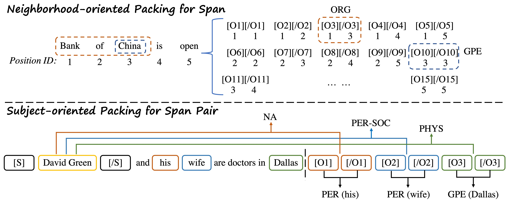

# PL-Marker
Source code for [Pack Together: Entity and Relation Extraction with Levitated Marker](https://arxiv.org/pdf/2109.06067.pdf).

## Quick links
* [Overview](#Overview)
* [Setup](#Setup)
  * [Install Dependencies](#Install-dependencies)
  * [Data Preprocessing](#Download-and-preprocess-the-datasets)
  * [Pre-trained Models](#Pre-trained-Models)
* [Training Script](#Training-script)
* [Quick Start](#Quick-start)
* [Use TypeMarker](#TypeMarker)
* [Citation](#Citation)


## Overview


In this work, we present a novel span representation approach, named Packed Levitated Markers,  to consider the dependencies between the spans (pairs) by strategically packing the markers in the encoder. Our approach is evaluated on two typical span (pair) representation tasks:

1. Named Entity Recognition (NER): Adopt a group packing strategy for enabling our model to process massive spans together to consider their dependencies with limited resources.

2. Relation Extraction (RE): Adopt a subject-oriented packing strategy for packing each subject and all its objects into an instance to model the dependencies between the same-subject span pairs

Please find more details of this work in our paper.


## Setup
### Install Dependencies

The code is based on huggaface's [transformers](https://github.com/huggingface/transformers). 

Install dependencies and [apex](https://github.com/NVIDIA/apex):
```
pip3 install -r requirement.txt
pip3 install --editable transformers
```

### Download and preprocess the datasets
Our experiments are based on three datasets: ACE04, ACE05, and SciERC. Please find the links and pre-processing below:
* CoNLL03: We use the Enlish part of [CoNLL03](https://www.clips.uantwerpen.be/conll2003/ner/)
* OntoNotes: We use `preprocess_ontonotes.py`  to preprocess the [OntoNote 5.0](https://catalog.ldc.upenn.edu/LDC2013T19).
* Few-NERD: The dataseet can be downloaed in their [website](https://ningding97.github.io/fewnerd/)
* ACE04/ACE05: We use the preprocessing code from [DyGIE repo](https://github.com/luanyi/DyGIE/tree/master/preprocessing). Please follow the instructions to preprocess the ACE05 and ACE04 datasets.
* SciERC: The preprocessed SciERC dataset can be downloaded in their project [website](http://nlp.cs.washington.edu/sciIE/data/sciERC_processed.tar.gz).


### Pre-trained Models
We release our pre-trained NER models and RE models for ACE05 and SciERC datasets on [Google Drive](https://drive.google.com/drive/folders/1k_Nt_DeKRKIRd2sM766j538b1JhYm4-H?usp=sharing)/[Tsinghua Cloud](https://cloud.tsinghua.edu.cn/d/5e4a117bc0e5407b9cee/).

*Note*: the performance of the pre-trained models might be slightly different from the reported numbers in the paper, since we reported the average numbers based on multiple runs.

## Training Script
Train NER Models:
```
bash scripts/run_train_ner_PLMarker.sh
bash scripts/run_train_ner_BIO.sh
bash scripts/run_train_ner_TokenCat.sh
```

Train RE Models:
```
bash run_train_re.sh
```

## Quick Start
The following commands can be used to run our pre-trained models on SciERC.

Evaluate the NER model:
```
CUDA_VISIBLE_DEVICES=0  python3  run_acener.py  --model_type bertspanmarker  \
    --model_name_or_path  ../bert_models/scibert-uncased  --do_lower_case  \
    --data_dir scierc  \
    --learning_rate 2e-5  --num_train_epochs 50  --per_gpu_train_batch_size  8  --per_gpu_eval_batch_size 16  --gradient_accumulation_steps 1  \
    --max_seq_length 512  --save_steps 2000  --max_pair_length 256  --max_mention_ori_length 8    \
    --do_eval  --evaluate_during_training   --eval_all_checkpoints  \
    --fp16  --seed 42  --onedropout  --lminit  \
    --train_file train.json --dev_file dev.json --test_file test.json  \
    --output_dir sciner_models/sciner-scibert  --overwrite_output_dir  --output_results
```


Evaluate the RE model:
```
CUDA_VISIBLE_DEVICES=0  python3  run_re.py  --model_type bertsub  \
    --model_name_or_path  ../bert_models/scibert-uncased  --do_lower_case  \
    --data_dir scierc  \
    --learning_rate 2e-5  --num_train_epochs 10  --per_gpu_train_batch_size  8  --per_gpu_eval_batch_size 16  --gradient_accumulation_steps 1  \
    --max_seq_length 256  --max_pair_length 16  --save_steps 2500  \
    --do_eval  --evaluate_during_training   --eval_all_checkpoints  --eval_logsoftmax  \
    --fp16  --lminit   \
    --test_file sciner_models/sciner-scibert/ent_pred_test.json  \
    --use_ner_results \
    --output_dir scire_models/scire-scibert
```
Here,  `--use_ner_results` denotes using the original entity type predicted by NER models.


## TypeMarker
if we use the flag `--use_typemarker` for the RE models, the results will be:

| Model | Ent | Rel | Rel+ |
| :-----| :----: | :----: | :----: |
| ACE05-UnTypeMarker (in paper) | 89.7 | 68.8 | 66.3 |
| ACE05-TypeMarker | 89.7 | 67.5 | 65.2 |
| SciERC-UnTypeMarker (in paper) | 69.9 | 52.0 | 40.6 |
| SciERC-TypeMarker | 69.9 | 52.5 | 40.9 |


Since the Typemarker increase the performance of SciERC but decrease the performance of ACE05, we didn't use it in the paper.


## Citation
If you use our code in your research, please cite our work:
```bibtex
@article{ye2021plmarker,
  author    = {Deming Ye and Yankai Lin and Maosong Sun},
  title     = {Pack Together: Entity and Relation Extraction with Levitated Marker},
  journal   = {arXiv Preprint},
  year={2021}
}
```